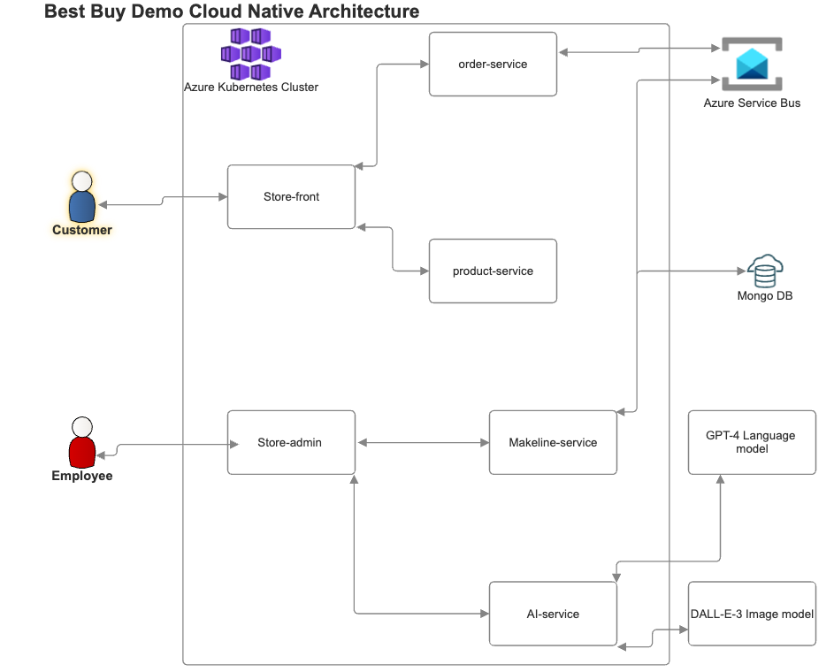

# Best Buy Cloud-Native Application Demo - Final Lab Assignment CST8915

## 📦 Project Overview

This cloud-native application simulates Best Buy’s online store using a microservices architecture. The application supports product browsing, ordering, admin operations, and order fulfillment. It also features AI-powered product description and image generation using GPT-4 and DALL·E.

This project is a customized version of the **Algonquin Pet Store (On Steroids)** architecture, with key improvements:
- 📨 Replaced RabbitMQ with **Azure Service Bus**
- 🤖 Added AI-Service using **Azure OpenAI (GPT-4 + DALL·E)**

---

## 🧱 Application Architecture



The architecture consists of multiple microservices deployed on a Kubernetes cluster:

| Component        | Description                                      |
|------------------|--------------------------------------------------|
| Store-Front      | Customer-facing UI for product browsing & orders |
| Store-Admin      | Admin UI for managing products & viewing orders  |
| Product-Service  | Handles product CRUD operations                  |
| Order-Service    | Sends order details to Azure Service Bus         |
| Makeline-Service | Consumes from Azure Service Bus and completes orders |
| AI-Service       | Uses GPT-4 for descriptions & DALL·E for images  |
| MongoDB          | Stores product and order data                    |

---

## 🚀 Deployment Instructions

Follow these steps to deploy the application to a Kubernetes cluster.

### 🔧 Prerequisites

- Kubernetes cluster (e.g., Azure Kubernetes Service or Minikube)
- `kubectl` configured to target your cluster
- Docker Hub or Azure Container Registry access
- Azure Service Bus queue created
- Azure OpenAI resource provisioned

### 📤 Deploy to Kubernetes

```bash
# Step 1: Apply ConfigMaps and Secrets
kubectl apply -f Deployment\ Files/configmaps.yaml
kubectl apply -f Deployment\ Files/secrets.yaml

# Step 2: Deploy MongoDB
kubectl apply -f Deployment\ Files/mongo-statefulset.yaml

# Step 3: Deploy microservices
kubectl apply -f Deployment\ Files/store-front-deployment.yaml
kubectl apply -f Deployment\ Files/store-admin-deployment.yaml
kubectl apply -f Deployment\ Files/product-service-deployment.yaml
kubectl apply -f Deployment\ Files/order-service-deployment.yaml
kubectl apply -f Deployment\ Files/makeline-service-deployment.yaml
kubectl apply -f Deployment\ Files/ai-service-deployment.yaml

# Step 4: Expose services (use Ingress or NodePort)
kubectl apply -f Deployment\ Files/ingress.yaml
```

---

## 🔗 Microservice Repositories

| Service           | Repository Link                   |
|-------------------|-----------------------------------|
| Store-Front       | [https://github.com/kare0041/store-front-best-buy.git]                     |
| Store-Admin       | [https://github.com/kare0041/store-admin-best-buy.git]                     |
| Product-Service   | [https://github.com/kare0041/product-service-best-buy.git]                     |
| Order-Service     | [https://github.com/kare0041/order-service-best-buy.git]                     |
| Makeline-Service  | [https://github.com/kare0041/makeline-service-best-buy.git]                     |
| AI-Service        | [https://github.com/kare0041/ai-service-best-buy.git]                     |

---

## 🐳 Docker Images

| Service           | Docker Image Link                 |
|-------------------|-----------------------------------|
| Store-Front       | [https://hub.docker.com/repository/docker/kadanielo/store-front-best-buy/general]                 |
| Store-Admin       | [https://hub.docker.com/repository/docker/kadanielo/store-admin-best-buy/general]                 |
| Product-Service   | [https://hub.docker.com/repository/docker/kadanielo/product-service-best-buy/general]                 |
| Order-Service     | [https://hub.docker.com/repository/docker/kadanielo/order-service-best-buy/general]                 |
| Makeline-Service  | [https://hub.docker.com/repository/docker/kadanielo/makeline-service-best-buy/general]                 |
| AI-Service        | [https://hub.docker.com/repository/docker/kadanielo/ai-service-best-buy/general]                 |

---

## 📹 Demo Video

Watch the 5-minute demo here:  
🔗 [YouTube Demo Link](https://youtube.com/example-demo)

---

## ⚠️ Known Issues or Limitations

- AI-Service requires a stable internet connection and valid API keys.
- Limited error-handling in the demo version.
- Orders may take a few seconds to process via the queue.

